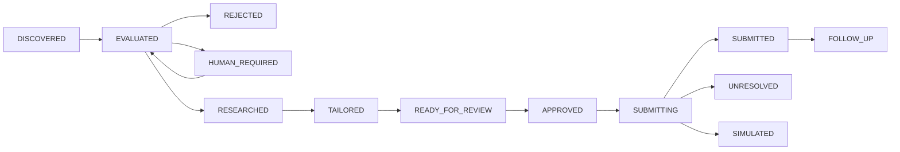

# Get-Hired-NOW

**Discover selectively. Ground every claim. Keep the candidate in control.**

Get-Hired-NOW is an open-source job-search workflow with durable state, replaceable
integrations, and enforced human gates. It turns a candidate's own facts into an
evidence map and an application packet, then checks authorization before any
external action.

**v0.1 is a working local workflow core and agent playbook.** It includes a Python
CLI, interactive onboarding, SQLite state, a file-based job source, a simulated
application provider, a local CSV tracker, and executable regression fixtures.
Live job-board connectors, browser submission, model inference and polished résumé
rendering are extension points; they are not bundled or claimed to work today.

## Try it without accounts or candidate data

Python 3.10 or newer is required. The core has **no third-party runtime dependencies**.
From a checkout:

```sh
python tools/demo.py
python -m unittest discover -s tests -v
```

The demo uses explicitly fictional data in a temporary private directory. It
finishes in `SIMULATED`, makes no network requests, and deletes its temporary data.
Fictional locations, currency `TOK`, employers and amounts are test values, not
recommendations or a default candidate profile.

## Start your own private workflow

```sh
python -m get_hired_now setup
python -m get_hired_now discover /path/to/your/jobs.json
python -m get_hired_now list
```

Alternatively, install the CLI with `python -m pip install -e .` and use
`get-hired-now` in place of `python -m get_hired_now`.

Setup is a conversation. It asks for your name/contact, original CV or résumé,
location, target roles, salary floor and units, constraints, work authorization,
work history, skills, education and availability. Optional unknown facts stay
unknown. You review the collected values before saving. No identity, employment,
compensation or integration settings are inferred from a machine or chat history.

Private data goes to `~/.get-hired-now`, outside the repository. Use `--home` or
`GET_HIRED_NOW_HOME` for a different private directory. Each candidate needs a
separate directory. The application refuses to store state inside a Git checkout.

For a job key returned by discovery:

```sh
python -m get_hired_now evaluate JOB_KEY
python -m get_hired_now prepare JOB_KEY
python -m get_hired_now review JOB_KEY
python -m get_hired_now approve JOB_KEY
python -m get_hired_now submit JOB_KEY
python -m get_hired_now track JOB_KEY
```

`JOB_KEY` is a placeholder; replace it with the full saved key. The default
submission provider simulates an application even after approval. It never sends
one to an employer. `prepare` builds a grounded JSON packet with verified claims,
question answers, evidence references and the supplied original résumé; it does
not generate a new PDF or invent résumé prose.

## The four foundations

| Foundation | Implemented behavior |
| --- | --- |
| Explicit state | SQLite records jobs, revisions, transitions, audit events, approvals, attempts and receipts across restarts. |
| Replaceable adapters | Protocols separate job sources, application providers, candidate stores, trackers, notifications and résumé rendering. |
| Formal permissions | OBSERVE, REVIEW and AUTONOMOUS policies are checked by the write gateway. Approval binds to the exact current action. |
| Regression fixtures | Ten supplied scenarios plus tests for stale approvals, resume changes, duplicate reservations, restart recovery and privacy. |



`RESEARCHED` records the supplied requirement/source evidence review; the core
does not browse the web. `TAILORED` means an evidence-selected packet was created.
A click, timeout or prepared file never counts as employer acceptance.

## Permission modes

| Mode | Evaluate/research | Prepare locally | External writes |
| --- | --- | --- | --- |
| OBSERVE | Yes | No | Never |
| REVIEW (default) | Yes | Yes | Exact human approval per action |
| AUTONOMOUS | Yes | Yes | Explicit action allowlist; submissions also require `auto_submit: true`, or a scoped human approval |

All modes preserve hard human gates for CAPTCHA/security challenges, human-only
assessments, unexpected legal declarations, missing or conflicting facts, and
material requirement conflicts. An approval cannot override these gates.

## Documentation and layout

- [Setup and daily use](docs/setup.md)
- [Architecture, schemas and state recovery](docs/architecture.md)
- [Adapter and agent customization](docs/customization.md)
- [Safety, permissions and privacy](docs/safety-and-approval.md)
- [Evaluation fixtures and release checks](docs/evaluations.md)
- [Agent responsibilities](agents/README.md) and [workflow playbooks](workflows/job-search.md)
- `config/`: placeholder-only configuration references, never active candidate defaults.
- `examples/`: explicitly fictional test data.
- `tests/cases/`: self-contained inputs and expected behavior.

## Privacy before publication

```sh
python tools/privacy_scan.py
python tools/privacy_scan.py --history
```

The second command needs initialized Git history. The scanner checks recursive
source files and reachable commit/blob history, including author metadata. Use
`--denylist /private/path/terms.txt` for known private names, identifiers and other
literal strings; never put that denylist in the repository. Built-in checks cover
common token formats, credentials, private key headers, personal home paths,
non-example email addresses and private artifact paths. Manual review remains
necessary: no pattern scanner can prove the absence of every personal detail.

## Current limits

- The supplied provider is a simulation. Real services need a trusted adapter,
  appropriate credentials, and separate integration testing.
- Facts and source extracts are supplied by a person or trusted host. The core
  does not independently prove employment, parse a CV, or verify a receipt's
  authenticity against an employer API.
- Salary comparison requires identical currency, period and basis. Unknown pay
  or eligibility blocks submission. There is no automatic currency conversion.
- SQLite and resume files are local plaintext. Use OS access controls and disk
  encryption appropriate to your environment; do not commit or cloud-share them.
- This is a trusted local process, not a sandbox against malicious adapters or
  an agent with unrestricted filesystem access. The host owns the human boundary.
- There is no built-in scheduler, outreach sender, application retry loop or LLM
  benchmark. The tests measure deterministic engine behavior.

MIT licensed. Contributions should use fictional fixtures and preserve the
permission and evidence guarantees. See [CONTRIBUTING.md](CONTRIBUTING.md).
